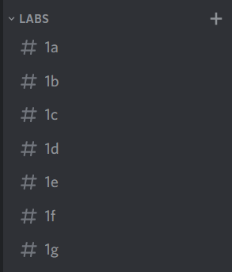
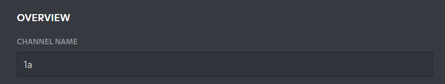
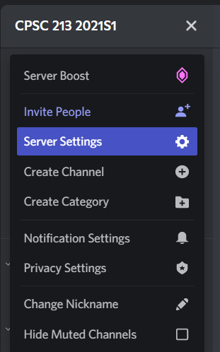
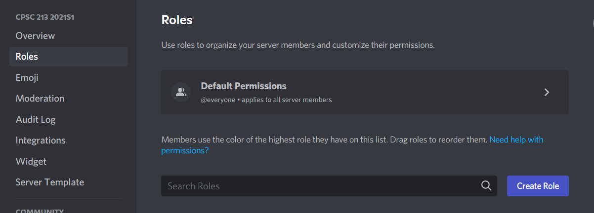
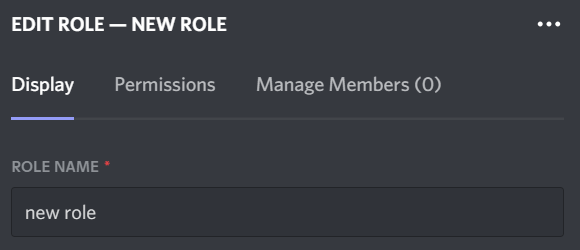
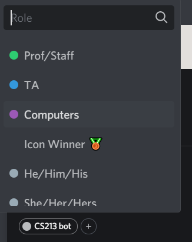

# Instructions to assemble CS213bot and a Discord server in any arbitrary term (for TAs only)

Prerequisite: a Discord account from [https://discord.com/](https://discord.com/).

## Step 1: make server
The following URL is a **server template** which can be used to instantly deploy a blank CPSC 213 server:\
[https://discord.new/yKdQkgr4SEKB](https://discord.new/yKdQkgr4SEKB)

Set the name of the server to `CPSC 213 TERMX#` where `TERMX#` is replaced with the current academic term (e.g. `2021W1`, `2020S2`, etc).

Give the server a nice profile picture. The usual one is:\
\
which looks much nicer when rounded by Discord's cropping system.

Inside the server, there should be some channels under `LABS`. These are the only ones that need to be changed.\
Scroll down to the category that says `LABS` — it should look like:\
\
Each channel (e.g. `#1a`) should have a gear icon beside it. Click it, and you should get this:\
\
If the current academic term is second term, change the channel name to have a `2` instead of a `1`.

Also, add lab channels based on the number of labs in the current academic term by pressing the `+` icon beside `LABS` to add them. A text box should pop up — simply add the name of the lab and hit `Create Channel`.

To match these channels, you can create pingable "lab roles" to notify members of your lab group. Click the name of the server and then click `Server Settings`:\
\
On the sidebar, click `Roles`, then click the `Create Role` button:\
\
Change the `new role` text to the name of the lab:\
\
Close the window using the round X icon in the top right when you finish.

It is **very important** that all lab roles follow the same format: `L#X` (e.g `L1A`, `L2B`). Otherwise, the bot will not be able to assign them to people.

It is also **very important** that **no other channels be deleted or have their names changed** (except ones explicitly specified to be changed in this document). The bot requires them to have specific names in order to send notifications.

## Step 2: create Discord bot

This step should only be done if you do not already have a working copy of the bot from a previous server.

Go to [https://discord.com/developers/applications/](https://discord.com/developers/applications/). After you log in with your Discord account, click `New Application` in the top right corner. A box should appear asking for a name; put `CS213bot` and hit `Create`.

Under `General Information`, give the bot a `NAME`: `CS213bot`, and an icon (feel free to use the same icon as the server). Then on the left-hand side, there should be a puzzle icon called `Bot`. Click on it, and then follow the on-screen prompt to create a bot.

There should then be an option to give another name and icon; do the same thing you did for General Information.

Finally, go to `OAuth2`, which should have a wrench icon on the left-hand side. Scroll down, and under the `SCOPES` table, click the checkbox that says `bot`. In the table just below it called `BOT PERMISSIONS`, click the checkbox that says `Administrator`. Scroll back up to the `SCOPES` table and hit `Copy` beside the URL at the bottom.

Paste the URL into your browser and, in the drop-down that shows up saying `Select a server`, choose the CPSC 213 server you just created. Click `Authorize` and follow all prompts. The bot should then be present in your server.

Finally, click on the bot in the server, click the `+` icon beside the existing roles, and find the `Computers` role. Give it to the bot by clicking on it:\

Before proceeding, go back to the `Bot` tab of the Discord developer page. Under `TOKEN`, click `Copy`.

## Step 3: fetch code

This step should only be done if you do not already have a working copy of the bot from a previous server.

Clone this repo to your local machine or remote server. In an ideal scenario, the device should be capable of running 24/7 with minimal downtime. In a less-ideal scenario, the device should be capable of running during active PST hours (e.g. 9am PST to as late as possible), 7 days a week.

## Step 4: set secret keys (do this step each term)

Inside the folder, create a file named `.env`. This file should contain four lines of information:

- `CS213BOT_KEY=PUT_YOUR_TOKEN_HERE` Insert this line and replace `PUT_YOUR_TOKEN_HERE` with the token you copied from the developer portal. Make sure not to leak this token to anyone. This token does not change between terms so you can reuse it if needed.

- `PLTOKEN=PUT_YOUR_TOKEN_HERE` Insert this line and replace `PUT_YOUR_TOKEN_HERE` with an access token from your CPSC 213 PrairieLearn page. To get this token, access the page and click on your name in the top right corner. A drop-down should appear that says `Settings`. Click on it, and then hit `+ Generate new token` when it appears. Give it any name, and then click `Generate token`. A special access token should appear on the page; copy it and paste it into the `.env` file immediately as you will not be able to reach it again.

- `SERVER_ID=YOUR_SERVER_ID` Insert this line and replace `YOUR_SERVER_ID` with the ID of the server you made. To get this ID, go into your Discord settings (click the gear icon in the bottom-left of your regular Discord window) and scroll down to the `Advanced` tab. Activate the switch that says `Developer Mode`, and then exit the settings window by clicking the `X` escape button in the top right. Hover over the icon for your new 213 server, right-click it and then click `Copy ID`. Paste this into your `.env` file.

- `COURSE_ID=YOUR_COURSE_ID` Insert this line and replace `YOUR_COURSE_ID` with the ID of the 213 course on PrairieLearn. To find it, open the 213 course on PrairieLearn. In the URL in your browser, there should be exactly one four, possibly five digit number. Copy it and paste it into the `.env` file.

When all four lines are pasted into the `.env` file, save it.

## Step 5: deploy bot

If you haven't run the bot before, make sure Python 3.9 and pip are installed on your computer.

Run `pip install -r requirements.txt`, which installs libraries used by the bot.

Finally, launch the bot by calling `python3 cs213bot.py`. If you wish to keep the bot running indefinitely, and are using Linux, call `python3 cs213bot.py &` to allow the bot to function without a terminal.

## Step 6: send a welcome message

In the `announcements` channel, send a greeting for the students. Add some useful information such as what channels do (e.g. bot-commands for bot commands, pl-dashboard for PrairieLearn updates) and highlight useful features. The channels that should be highlighted are:

- `prairielearn-notifs`: real-time updates for quizzes and assignments on PrairieLearn, featuring due date reminders
- `pl-dashboard`: real-time dashboard containing all active assignments and quizzes
- `bot-commands`: channel for using bot commands
- lab channels: channels for updates from the labs in the course

Bot commands that should be highlighted are:
- `!ref`: call this to display SM213 instruction reference
- `!checkservers`: call this to check the uptime status of the CPSC remote servers

The `!join` command should be advertised as a way to join specific roles. This should be done by saying:
- call `!join he`, `!join she`, `!join they`, or `!join ze` to have a preferred pronouns role appear on your profile
- call `!join notify` to receive notifications for PrairieLearn assignments
- call `!join L1A` (where L1A is replaced with your lab) to receive notifications for updates for your lab sections
- call `!join looking for partners` to identify that you are looking for a partner for a group assignment

Do not advertise `looking for partners` until group assignments are actually deployed.

Also point out the blue `TA` role representing TAs in the course.

## Step 7: invite people

Before inviting any students, create an invite link to send to the other TAs. Click on the server name again and then click `Invite People`.

Click the small text that says `Edit invite link.` Click the dropdown for `EXPIRE AFTETR` and select `Never`. Click `Generate a New Link` and copy the link to share with the other TAs.

Have the TAs identify themselves by direct messaging you with their Discord usernames (outside of Discord). For each person identified as a TA, give them the TA role. Do not give the role to TAs who did not explicitly ask for the role.

If a professor or instructor asks to be identified, there is also a green `Prof/Staff` that can be used in that scenario instead.

Only after the TAs have joined, send the link to the students either through Piazza, an email announcement, or in lecture.

## Step 8: maintenance and guidance

Broadcast this to the other TAs as necessary.

Spend only 1-2 hours monitoring the server per week unless you consistently have more time, as the more active the TAs are at answering questions, the more students will participate. Committing to more hours is a term-long commitment.

Similarly, if you DM students once, they will tend to DM you for the rest of the term, so do not commit to this unless you have the time. If you would like to prevent DMs, you can either kindly reply with "I prefer not to use my DMs, if that's okay", or you can physically lock DMs from students in the 213 server by right-clicking the server icon, selecting `Privacy Settings` and turning off `Allow direct messages from server members`. You can also go into `Notification Settings` to disable notifications coming out of the server.

Do not allow students to post code in the server, nor do anything that wouldn't be allowed on a public Piazza post. Direct students to Piazza if they need to ask a private question, or use DMs if you permit DMs. All TAs are equipped with the ability to delete the messages of anyone in the server should that ever be required.

## Step 9: exams

During exams such as midterms and finals **only**, the server is not allowed to be used by students. As such, there is a command called **!supershut on** which puts the server under total and complete lockdown, preventing anyone from using any of the channels. Doing so will make all channels invisible to students, while TAs will continue to have access. As this may confuse students, it is best after doing this to create a channel where nobody can send messages that says "server is closed until exam is finished". To ensure nobody can send message, click the gear beside the channel name, go to `Permissions`, go to `@everyone` and set `Send Messages` and `Add Reactions` to the red `X`.

When the exam finishes, delete this channel (this channel can be deleted) and run **!supershut off** to reactivate the server. Do not do this until everyone has finished the exam, including those from the Centre for Accessibility. When in doubt, if Piazza is off, keep Discord closed.

## Step 10: passing the torch

At the end of the term, feel free to keep the server open. Ensure that a new server is made for the following term so as to keep content separate. Feel free to delete the invite link to the existing server.

If reusing the bot, make sure to turn it off, change the `.env` file according to Step 4, and turn it back on again only after following all the steps for making a new server.

If ever necessary, a person would be able to start from scratch using only the instructions on this page; access to the server or to any TA of the previous term is not required.

**This concludes the instruction manual**. If you have any further questions, raise an issue in this GitHub repository.